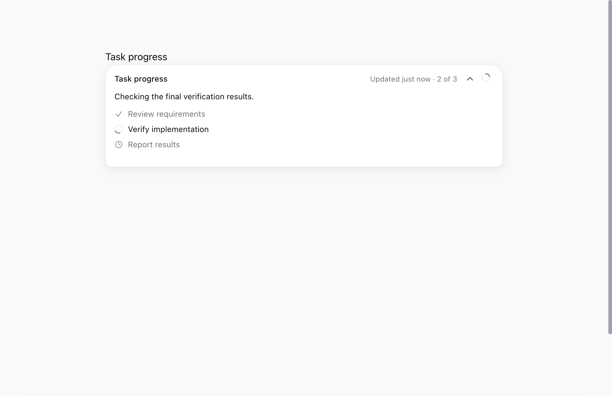
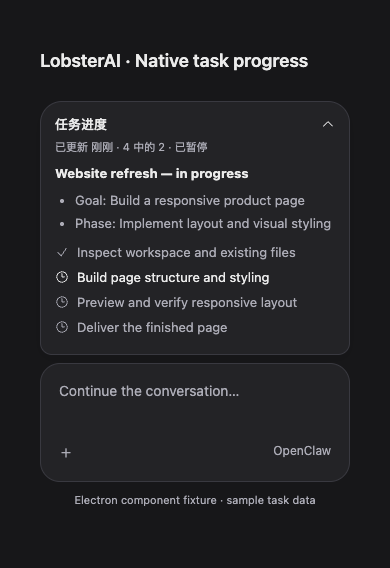

# Native OpenClaw progress cards in Cowork

Cowork displays the persisted OpenClaw progress card above the existing composer and its question/queue controls. This is a React port of OpenClaw `v2026.8.1`'s `ui/src/components/session-progress-card.ts` and associated styles, at commit `ea806575e6450e4d1efdfc72c19f04be982a1b9b`. The upstream MIT notice is retained in `third-party-notices/openclaw-progress-card-LICENSE.txt`.

## Data and interaction contract

- The main process resolves a local Cowork session ID to its native session key. Narrow IPC exposes read, refresh, completed-card dismissal, and invalidation notifications; requests are restricted to the main window's main frame and a known local session.
- `progressCard.get` reads native persistence on session entry and Gateway reconnection. `progressCard.changed` triggers a fresh read. Chat history is not used to reconstruct cards.
- Card Markdown and step states remain authoritative. Markdown-only and steps-only cards are supported. Completion is never inferred from a stopped or failed turn.
- New incomplete cards expand by default. Updates preserve the user's collapse choice. The compact heading uses the current step and its actual position. Long content scrolls internally; narrow layouts, dark themes, and reduced motion are supported.
- A failed read retains the last card and exposes retry; a successful empty response removes it. Request generations and connection/session checks discard late responses.
- Dismissal requires completed steps and uses `expectedRevision`. A concurrent native update is retained instead of accidentally cleared.
- Raw HTML is disabled. Only validated numeric `<progress>` elements are admitted. Remote images are not loaded, and clicked links are restricted to HTTP(S) through the existing external-link bridge.

## Creating progress during ordinary tasks

Each outbound turn asks the agent to create and maintain a native plan for multi-action work. The authorized `progress_card` tool stays directly callable through tool-search/catalog compaction, with explicit policy denial preserved. Native card updates remain model-authored.

Before a native plan exists, the UI can derive a separate execution list from at least two recorded tool calls in the latest visible user turn. Successful final results, failures, active calls, and interrupted calls remain distinct. Historical pages and old host placeholders do not masquerade as current plans. No fallback card is written to Gateway persistence. The existing atomic `ifAbsent` write extension remains backward-compatible for other clients.

## Active refresh

The Refresh progress button retains the old card while `progressCard.refresh` asks for a status update. The version-scoped `zzzz-openclaw-progress-card-refresh.patch` adds this operator-write RPC under the original caller's session authorization. It dispatches a fixed hidden steer with reporting/read-only tools; it does not authorize resuming stopped work. User and assistant transcript display, activity, and lifecycle projections remain hidden, and session initialization preserves stale completed/cancelled sessions.

The receipt carries the original revision and a stable request identity. A lost acknowledgment retries with the same identity; a terminal result allows a new explicit intent. The renderer waits for a higher revision or clear, polls every two seconds, and times out after 45 seconds without hiding the old card. Session/connection changes and late acknowledgments are guarded.

Main, preload, and the patched bundled runtime must ship together in a full desktop release. No OpenClaw version upgrade is introduced.

## Validation

- 338 desktop tests across the adapter, main bridge, renderer hook, components, Markdown, and patch inventory.
- 273 pinned-runtime tests covering progress handlers, refresh identity/authorization races, real SQLite stale-session initialization, hidden provenance, chat dispatch/transcript behavior, and tool catalog visibility.
- Changed-file ESLint with zero warnings; renderer and Electron TypeScript checks; production renderer build and Electron compilation. Runtime `tsgo:core` and typed lint passed.
- All 59 patches applied to clean OpenClaw `v2026.8.1`; a repeat application skipped all 59.
- An isolated Electron fixture rendered the actual component, clicked Refresh, verified that the original steps remained while the button was disabled, and verified that a later revision settled the refresh without another request. The fixture uses invented task data and a mock Gateway bridge.

Live model end-to-end behavior, packaged restart/reconnect acceptance, and native Windows testing still need validation. Existing light/dark screenshots predate the refresh enhancement; the refresh screenshot below shows the current component fixture.

