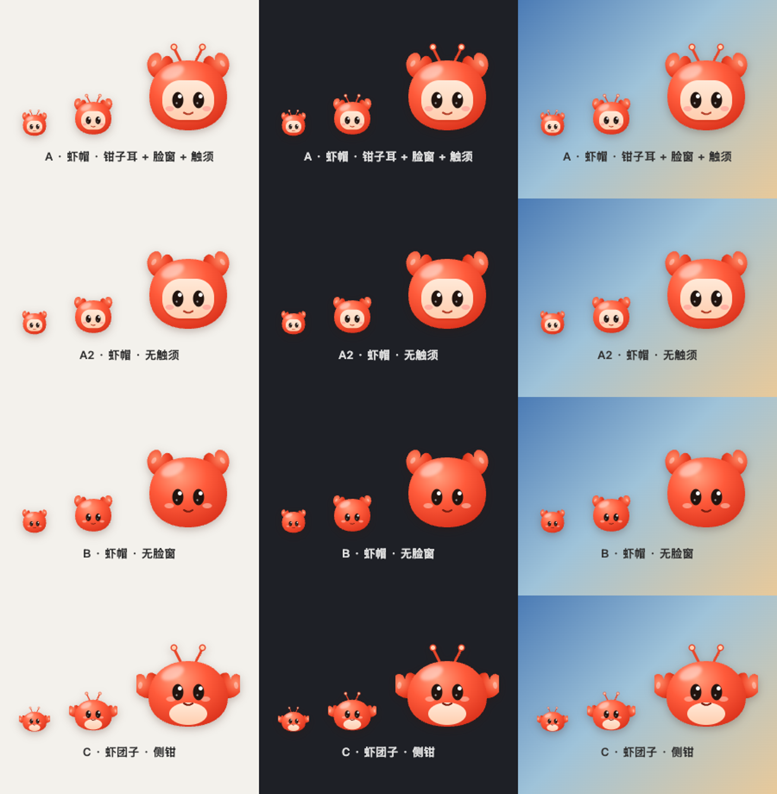
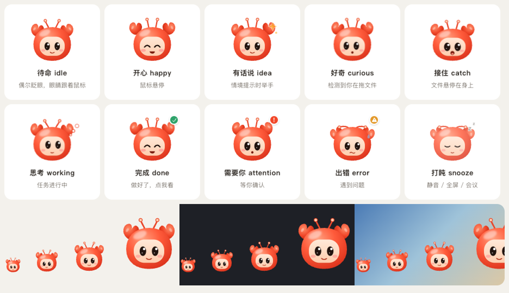
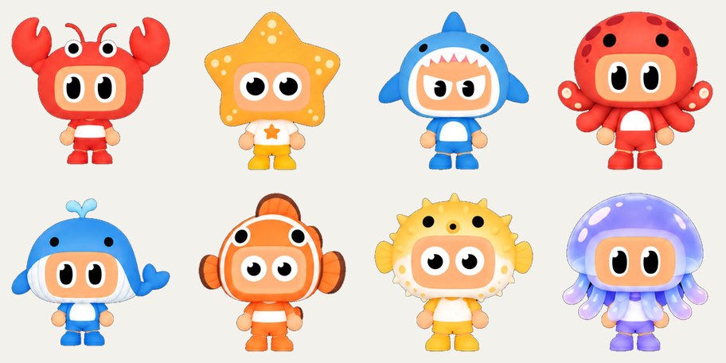
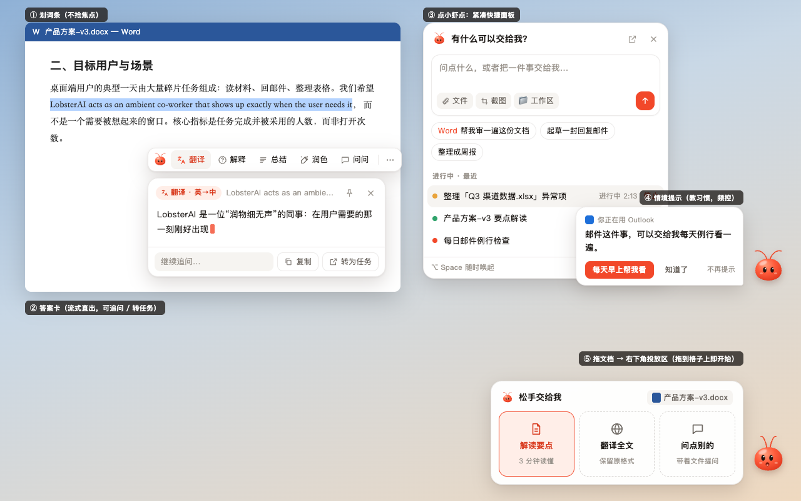
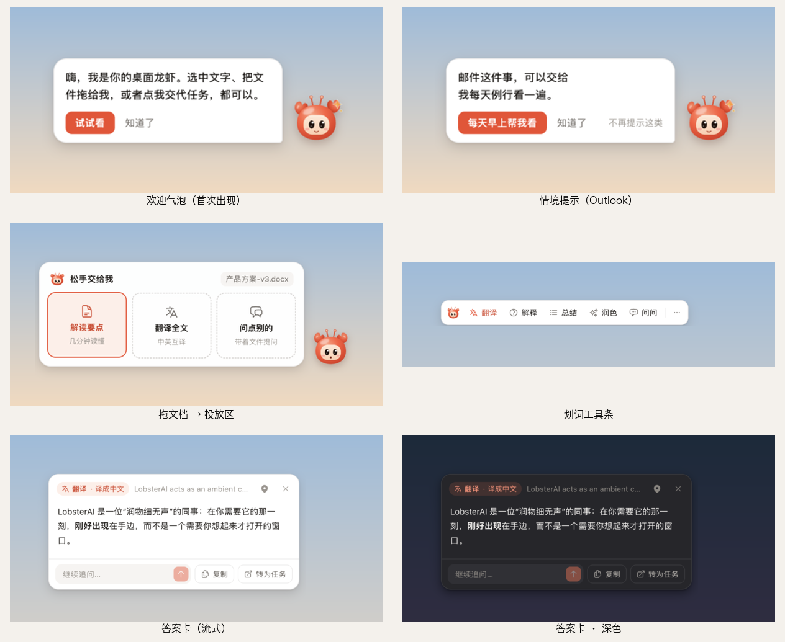
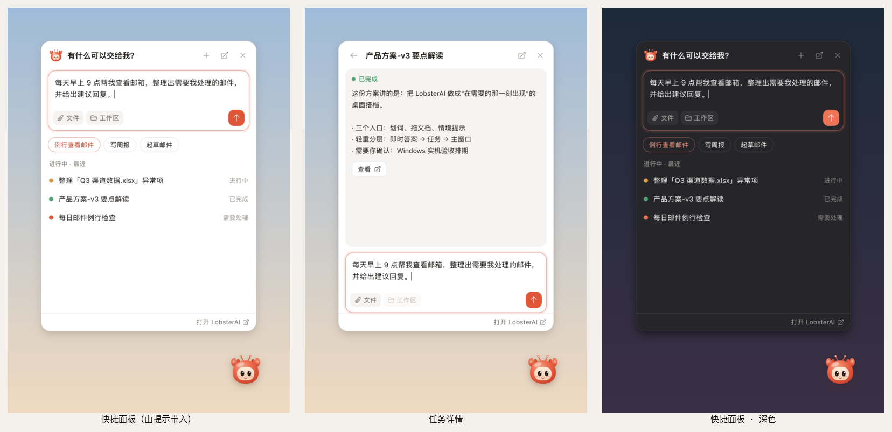

# 桌面龙虾 v2：从「悬浮球」到「工作流里的搭档」

2026-10-05 · 方案稿 · 取代 2026-09-13 设计稿中「首版不做全局划词 / 不读当前应用」的范围限制

## 0. 对 v1 的判断

v1 把悬浮球做成了「一个常驻的任务表单入口」：静态机器人图 + 416×560 的提交面板（文件夹、三张示例卡）。问题不在细节，而在**时机**：用户必须先想起 Lobster、再点它、再填表。它没有出现在用户正在做事的地方，所以打开率上去了，使用率不会跟着上去。

v2 的核心改变：**让 Lobster 在需要它的那一刻自己出现在手边**——选中文字时、拖动文档时、切到某类应用时。悬浮球本身退为一个有生命感、几乎不打扰的存在。

## 1. 原则

1. **时机优先于入口**：出现在选区旁、拖拽路径上、当前应用的语境里，而不是等用户想起来。
2. **一步见效**：划词一点就出结果；把文件拖到格子上就开始。不填表、不选文件夹。
3. **轻重分层**：即时答案（直连模型、流式、秒出、不建会话）→ 任务（Cowork 会话 + Agent）→ 主窗口（完整工作台）。每一层都能一键升级到下一层。
4. **克制**：不抢焦点、不自动读屏幕或剪贴板、不自动发送内容；全屏/会议安静；频控；任何提示都能一键「不再提示」。
5. **有生命但不吵**：待机近乎静止（只偶尔眨眼、眼睛跟随光标），有事才动。

## 2. 形象

**默认：钳钳（A 方案，英文名 Clawdie）**。一只戴着龙虾帽的小家伙：珊瑚红的帽子、帽顶两只小钳子当耳朵、一对带奶油色小球的触须、奶油色脸窗里一双大眼睛。它和你设计的 8 个海洋角色是同一个家族（大头、脸窗、糖果色），但只保留头部，36px 也能看清表情。纯 SVG 矢量，任何 DPI 清晰，所有表情由代码驱动。

- 10-05 的第一版「小虾点」（团子 + 细触须）被否：细触须像昆虫、团子没有性格、小尺寸下只剩一团红。
- 钳子耳朵是它的签名：警觉时竖起、庆祝时向上向外张开、出错或打盹时耷拉下来；有话说时举起右钳。
- 没脸窗（B）在深色桌面上眼睛不够清楚；侧钳团子（C）轮廓怪。

| 状态 | 触发 | 表现 |
| --- | --- | --- |
| 待命 | 默认 | 3–6 秒随机眨眼，眼睛跟随光标，小微笑 |
| 开心 | 鼠标悬停 | 眯眼笑、张嘴笑，钳子举起，腮红加深 |
| 有话说 | 情境提示出现 | 举起右钳 + 星星 |
| 好奇 | 检测到全局拖文件 | 钳子竖起轻晃，触须抖动，嘴巴「o」 |
| 接住 | 文件悬停在钳钳/投放区上 | 张大嘴、眼睛放大、身体轻压 |
| 思考 | 有任务执行中 | 眼睛看向右上，钳子交替轻点，触须摆动，右上角思考泡泡 |
| 完成 | 任务完成且未查看 | 眯眼笑 + 钳子挥舞两下 + ✓ 角标 |
| 需要你 | 等待权限确认/回答 | 眼睛放大、钳子竖起 + ! 角标 |
| 出错 | 任务失败 | 波浪嘴、汗滴、钳子和触须耷拉 |
| 打盹 | 静音 / 全屏 / 会议应用在前台 | 闭眼、钳子触须耷拉、半透明、zz |

**停靠**：拖到屏幕左右边缘自动吸附并半身藏入（corner peek），悬停滑出。默认位置右下。

**可选形象**：你设计的 8 个海洋角色（软软虾、醒醒星、鲨饿饿、章多多、鲸一鸣、溜溜鱼、胆怕怕、轻轻飘）作为「换个形象」选项（设置 + 右键菜单）。当前用原图抠出的透明图占位：

> 需要设计配合：每个角色导出透明 PNG（≥ 384px），最好补 idle / working / done / attention 四个状态帧（或 Lottie）。占位图只做缩放/弹跳动画，不做眨眼。

## 3. 四个入口

### 3.1 划词（系统级）

- 任意应用选中文字 → 选区下方出现小条：**翻译 · 解释 · 总结 · 润色 · 问问 · ⋯**（⋯：复制、搜索、在此应用中关闭、暂停 1 小时、设置）。
- 智能排序：非中文文本「翻译」置前；单词/短语「解释」置前；长文本（>200 字）「总结」置前。
- 小条**不抢焦点**（非激活窗口），原应用的选区保持。点任意别处、键盘输入、滚动、切应用即消失。
- 点动作 → 小条原地展开成**答案卡**：流式输出、可复制、可追问、可「转为任务」（带上下文建一个 Cowork 会话）、可固定。
- 执行通道：**直连当前默认模型（Anthropic Messages / Gemini 流式）**，不走 Agent，不建会话——首字快、不污染会话列表。
- 隐私：只有点击动作才发送选中文本；默认排除密码管理器、LobsterAI 自身；用户可加排除应用；剪贴板兜底（模拟 ⌘C）默认关闭。
- macOS 需要「辅助功能」权限：在开启划词时说明用途并引导授权，授权后自动生效；Windows 无需授权。

### 3.2 拖文档 → 右下角投放区

- 用户在 Finder / 资源管理器 / 桌面开始拖动文档时，钳钳旁边展开投放区（对应你的图 1），**拖到哪个格子就做哪件事**，松手即开始，不需要再点：
  - Word / PDF / 文本：解读要点 · 翻译全文 · 问点别的
  - Excel / CSV：分析数据 · 做成图表 · 问点别的
  - PPT：提炼要点 · 写讲稿 · 问点别的
  - 图片：识别文字 · 解释图片 · 问点别的
- 「问点别的」打开快捷面板并附上文件。其他格子直接建 Cowork 任务（Agent 读文件），钳钳切到「思考」，完成后「完成 ✓」+ 气泡「解读好了，点我查看」。
- 检测方式见 §4。无原生检测能力时退化为：文件拖到钳钳上时展开投放区。

### 3.3 情境提示（按当前应用教习惯）

文案教的是**习惯**而不是具体用法；每条提示带一个能把习惯落地的按钮：

| 前台应用类别 | 提示 | 按钮 |
| --- | --- | --- |
| Word / WPS / Pages | 写材料、改文档这类活，可以找我当秘书 | 试试看 |
| Excel / Numbers | 表格里的数，可以直接丢给我分析 | 试试看 |
| PowerPoint / Keynote | 做 PPT 之前，先让我帮你理一理思路 | 试试看 |
| 邮件（Mail / Outlook / Foxmail / 网易邮箱大师…） | 邮件这件事，可以交给我每天例行看一遍 | 每天早上帮我看 |
| 浏览器 | 网页上的重复操作，可以让我替你点 | 试试看 |
| IM（微信 / 钉钉 / 飞书 / 企业微信…） | 群里的长消息和文件，可以转给我整理 | 试试看 |
| Finder / 资源管理器 | 乱糟糟的文件夹，可以交给我整理 | 试试看 |
| PDF 阅读器 | 长文档别硬啃，拖给我先看要点 | 试试看 |
| 日历 | 每天的日程，我可以一早提醒你 | 每天早上提醒我 |

「试试看」打开快捷面板并预填一个对应示例（不自动发送）。

**频控（纯函数，单测覆盖）**：同一应用连续停留 ≥ 8 秒才考虑；全局间隔 ≥ 20 分钟；每天 ≤ 3 条；同类别 24 小时内最多 1 次；同类别累计 3 次未点击即停止该类；点过按钮视为「学会了」，7 天内不再提示该类；会议/全屏/静音时不提示；面板或答案卡打开时不提示；应用启动后 2 分钟内不提示。

**隐私**：只用前台应用标识（macOS bundle id / Windows 进程名），本地判断，不读窗口内容，不上报。

### 3.4 点钳钳：紧凑快捷面板

- 替代现有 416×560 表单：输入框（文件 / 截图 / 工作区）+ 与前台应用相关的建议 + 进行中/最近任务（状态、停止、查看）+ 打开主窗口。
- 保留 v1 已验证的能力：草稿与附件持久化、提交后清空、停止任务、跳转主会话、权限确认转主窗口。
- 工作区默认用应用的默认工作目录，不再强制先选文件夹。

右键菜单：隐藏 1 小时 / 今天不再打扰 / 换个形象 ▸ / 划词 ✓ / 拖拽投放 ✓ / 情境提示 ✓ / 设置… / 关闭桌面龙虾。

## 4. 技术方案

### 4.1 系统能力矩阵

| 能力 | macOS | Windows | 权限 |
| --- | --- | --- | --- |
| 划词（选区文本 + 坐标 + 来源应用） | `selection-hook`（AXAPI） | `selection-hook`（UIA / IAccessible） | mac 辅助功能 |
| 前台应用 | Electron `systemPreferences.subscribeWorkspaceNotification('NSWorkspaceDidActivateApplicationNotification')`，已实测可拿到 bundle id，零轮询、零原生依赖 | `koffi` 调 `GetForegroundWindow` → 进程名（1Hz 轮询） | 无 |
| 全局拖文件检测 | JXA（`osascript`）常驻小进程轮询拖拽剪贴板 `changeCount` + 文件路径，配合 `NSEvent.pressedMouseButtons`；与豆包同源思路（豆包用 NSEvent 全局监听 + 同一块拖拽剪贴板） | `koffi`：左键按下 + `SysDragImage` 窗口可见 | 无 |
| 全屏避让 | 现有 `visibleOnFullScreen: false` + selection 事件 `isFullscreen` | 前台窗口尺寸 = 显示器尺寸 | 无 |

**新增依赖**

- `selection-hook`（MIT，N-API 预编译，darwin/win32 x64+arm64，单平台 ~200–300KB）。最初为 Cherry Studio 划词助手开发，生产验证充分。
- `koffi`（MIT，N-API FFI）。**只在 Windows 加载**，用于前台应用与全局拖拽检测；所有调用封装在 `windowsNative.ts`，加载失败则对应能力自动降级。macOS 不需要任何 FFI。

打包：两者加入 `asarUnpack`；仓库已 `npmRebuild: false`，与 better-sqlite3 同样走预编译。Windows 需确认 `.node` 是否纳入签名（360 误报风险，见 §6）。

### 4.2 窗口

| 窗口 | 用途 | 焦点 |
| --- | --- | --- |
| orb | 钳钳；HTML5 拖放目标 | 不可聚焦 |
| stage | 情境气泡 / 投放区（按内容定尺寸，贴着钳钳） | 不可聚焦 |
| panel | 快捷面板（复用 v1 逻辑） | 可聚焦 |
| selection | 划词条 → 答案卡（同一窗口原地展开） | 条：不可聚焦；卡：可聚焦 |

全部复用 `desktop-companion.html?surface=…` 一个入口；selection 窗口预创建隐藏，保证选中后 <100ms 出现。

### 4.3 执行通道

- **QuickAnswer（新）**：主进程 `companionQuickAnswer.ts`，用 `resolveCurrentApiConfig()`（Anthropic 兼容，含本地兼容代理）流式请求，Gemini 原生单独解析；按动作模板拼提示词；可中止。
- **Task（复用）**：渲染进程直接调 `cowork.startSession / continueSession`（与 v1 面板一致），拖放与面板共用一个 `startCompanionTask()`。

### 4.4 模块划分

实际文件见 §8「实现记录」。主进程按职责拆成管理器、气泡/投放区、提示、划词、快答、前台应用、拖拽监听和唯一的 FFI 文件；纯逻辑（类别表、频控、动作排序与提示词、文件类型、几何）全部放在 `src/shared/desktopCompanion/` 并有单测。

`main.ts` 只保留初始化与清理两处接线（已存在）。

## 5. 分期

**P1（本轮）**
1. 钳钳矢量形象 + 状态机 + 停靠 + 右键菜单 + 8 个可选形象。
2. 投放区：拖到钳钳展开 + 按文件类型的格子 + 直接建任务；全局拖拽检测（macOS 先行）。
3. 情境提示：前台应用监听（macOS 原生通知、Windows koffi）+ 类别表 + 频控 + 气泡。
4. 划词：selection-hook 接入 + 划词条 + 答案卡 + QuickAnswer 流式 + 权限引导 + 排除应用。
5. 快捷面板重做为紧凑版。
6. 设置页扩展；纯逻辑单测；changed-file ESLint；`compile:electron` + `build`；macOS 实机验证。

**P2**
- 截图提问；提示按钮直达定时任务模板（邮件/日程）；Windows 实机 QA 后再打开 Windows 全局拖拽检测默认值；使用漏斗统计（沿用 09-13 稿的实验设计）。

## 6. 风险与待确认

1. **Windows 未实机验证**：koffi 调用与 SysDragImage 判断需要在 Windows 10/11 上 QA；在此之前 Windows 全局拖拽检测默认关闭，仅保留「拖到钳钳上」。
2. **签名与安全软件**：`selection-hook.node` 含全局鼠标钩子；Windows 安装包需确认 `.node` 签名覆盖，并在 360 等环境下回归。
3. **macOS 辅助功能权限**：开发态授权对象是 Electron 二进制而非 LobsterAI.app；正式包需在引导里说明。
4. **Chrome 辅助功能树**：selection-hook 会为 Chrome 打开 `AXEnhancedUserInterface`，可能带来轻微性能开销（库文档已注明）。
5. **资源占用**：常驻 orb + 预创建 selection 两个渲染进程；其余按需创建、空闲回收。待机动画只用定时眨眼，避免持续渲染。
6. **角色素材**：8 个角色目前是抠图占位，需要设计导出透明图与状态帧。

## 7. 竞品核对（包内证据，只读分析，未运行）

| 产品 | 做法 | 本方案的取舍 |
| --- | --- | --- |
| 豆包工作 2.29.7 | 划词：AX API 读 `AXSelectedText`/`AXBoundsForRange`，I-beam 光标门槛，剪贴板兜底会备份恢复；默认技能 搜索/翻译/解释/复制/朗读 + 下拉 总结/问问；默认不在 Finder、Figma、远程桌面里弹。拖文档：NSEvent 全局监听 + 拖拽剪贴板 `changeCount`，文案「把文档拖到这里，让我帮你解读」，支持 pdf/txt/csv/doc(x)/xls(x)/ppt(x)/md/mobi/epub/图片。前台应用：`NSWorkspaceDidActivateApplicationNotification` + Office 文档路径（Apple Events）+「启动其他应用时提醒我使用豆包打开或与豆包共享」开关；全屏检测用 AX + CGWindowList。悬浮球：贴左右边缘，右键含「隐藏直到下次重启」「停用」。 | 采用：默认排除 Finder/Figma/远程桌面；mobi/epub；贴边阈值放宽到 96px；拖拽检测同一原理。差异化：投放区按文件类型给 3 个格子、拖上即开始；情境提示教「习惯」而非推「用豆包打开」。P2 可借鉴：Office 当前文档路径（Apple Events）→ 提示里直接「把这份文档交给我」。 |
| ChatGPT 26.908（Codex pets） | 9 个精灵图角色，192×208 格，9 个动画状态 + 16 个视线方向；透明、不可聚焦、浮动层级窗口，默认右下 24px；任务状态优先级 等你输入 > 失败 > 待查看 > 运行中；首次出现挥手问好 8 秒一次。 | 采用：状态优先级、首次问好气泡、角标表达任务状态、视线跟随（我们跟随鼠标）。 |
| Muse 5.0（Jolly） | 预渲染 3D 毛绒视频（空闲/工作/制作/挥手/里程碑）；悬浮头像或胶囊；拖文件到头像上；一次性提示气泡。 | 采用：少量状态 + 少量庆祝；拖到角色上即投放。 |

## 8. 实现记录（2026-10-06）

**代码**

- 主进程 `src/main/desktopCompanion/`：`desktopCompanionManager.ts`（偏好、钳钳窗口、贴边探头、视线、静音、右键菜单、IPC）、`companionStage.ts`（气泡/投放区窗口）、`companionHints.ts`（停留计时 + 频控台账）、`companionSelection.ts`（selection-hook、划词条/答案卡窗口、消失规则、权限）、`quickAnswerService.ts` + `sse.ts`（流式直连模型）、`foregroundAppMonitor.ts`、`fileDragMonitor.ts`（mac JXA 小进程、win 轮询）、`windowsNative.ts`（唯一 FFI）、`companionWindow.ts`。
- 共享 `src/shared/desktopCompanion/`：`constants.ts`、`copy.ts`（中英）、`geometry.ts`、`appCategories.ts`、`hintPolicy.ts`、`selectionActions.ts`、`fileKinds.ts`、`skins.ts`。
- 渲染 `src/renderer/components/desktopCompanion/`：`mascot/LobsterHood.tsx`（矢量钳钳）、`mascot/CompanionCharacter.tsx`（矢量/图片形象 + 角标 + 眨眼）、`CompanionOrb.tsx`、`CompanionStage.tsx`、`SelectionSurface.tsx`、`CompanionPanel.tsx`（重做）、`DesktopCompanionSettings.tsx`（扩展）。
- 资源 `public/desktop-companion/skins/*.webp`（8 个角色占位，256px 透明）。
- 依赖：`selection-hook ^2.1.1`、`koffi ^3.3.2`，并加入 `asarUnpack`。

**验证**

- 单测 96 项（12 个文件）通过：几何、类别表、频控、动作排序与提示词、文件类型、SSE、系统事件解析、提示控制器、划词控制器、管理器生命周期/静音/投放/提示、心情优先级。
- 改动的 52 个 TS 文件 ESLint 零告警；`tsc`（renderer + electron）通过；`vite build` 产出 `desktop-companion` 入口与皮肤资源。
- QA 驱动：真实 `DesktopCompanionManager` + 真实 preload + 构建后的页面，用假事件驱动（首次问好、Outlook 提示→预填面板、全局拖文档→投放区、划词→翻译流式答案、任务详情、运行中、换形象、贴边探头），浅色与深色逐窗截图：

- 拖拽小进程实测：空闲 CPU 约 0.4%（单核）、RSS 约 22MB；父进程被强杀后 2–3 秒内自行退出。
- `selection-hook`、`koffi` 在 Electron 43 主进程实测可加载。

**仍需人工验收**

1. macOS 真实划词：开发态需给 `node_modules/electron/dist/Electron.app` 开「辅助功能」；在 Word/Chrome/微信里选中文字验证条的位置与消失规则，以及真实模型的流式答案。
2. macOS 真实拖拽：从 Finder 拖 docx/xlsx/pdf 验证投放区弹出时机与格子投放。
3. Windows 10/11 全量 QA：前台应用识别、`SysDragImage` 拖拽检测、划词坐标（DPI 缩放）、`.node` 签名与 360 环境。
4. 全量 `npm test` 有 13 项与本功能无关的失败：10 项安装器契约测试因 `node_modules/app-builder-lib`（8 月 7 日安装）落后于 9 月更新的补丁，需要 `npm ci`；其余 3 项依赖 macOS `/private` 临时路径或 OpenClaw 运行时。
